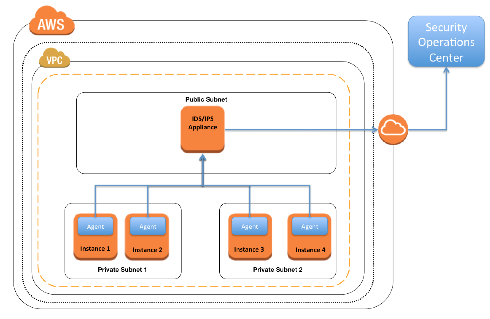

# AWS SAA(v.3)

1. Every user you create in the IAM system starts with _________.
* A. Partial permissions
* B. Full permissions
* C. No permissions

C. Explanation:  
Every IAM user starts with no permissions. In other words, by default, users can do nothing, not even view their own access keys.

2. When you run a DB Instance as a Multi-AZ deployment, the “_____” serves database writes
and reads
* A. secondary
* B. backup
* C. stand by
* D. primary

D. Explanation:  
When you run a DB instance as a Multi-AZ deployment, the “primary” serves database writes and reads. In addition, Amazon RDS provisions and maintains a “standby” behind the scenes, which is an up-to-date replica of the primary. The standby is “promoted” in failover scenarios. After failover, the standby becomes the primary and accepts your database operations. You do not interact directly with the standby (e.g. for read operations) at any point prior to promotion.

3. While creating an Amazon RDS DB, your first task is to set up a DB ______ that controls
what IP addresses or EC2 instances have access to your DB Instance.
* A. Security Pool
* B. Secure Zone
* C. Security Token Pool
* D. Security Group

D. Explanation:  
Your DB instance will most likely be created in a VPC. Security groups provide access to the DB instance in the VPC. They act as a firewall for the associated DB instance, controlling both inbound and outbound traffic at the instance level.

4. If I write the below command, what does it do?
`ec2-run ami-e3a5408a -n 20 -g appserver`
* A. Start twenty instances as members of appserver group.
* B. Creates 20 rules in the security group named appserver
* C. Terminate twenty instances as members of appserver group.
* D. Start 20 security groups

A. Explanation:  
Refer: https://docs.aws.amazon.com/cli/latest/reference/ec2/run-instances.html

5. Resources that are created in AWS are identified by a unique identifier called an __________
* A. Amazon Resource Number
* B. Amazon Resource Nametag
* C. Amazon Resource Name
* D. Amazon Reesource Namespace

C. Explanation:  
ARN: https://docs.aws.amazon.com/zh_cn/general/latest/gr/aws-arns-and-namespaces.html

6. What is the Reduced Redundancy option in Amazon S3?
* A. Less redundancy for a lower cost.
* B. It doesn’t exist in Amazon S3, but in Amazon EBS.
* C. It allows you to destroy any copy of your files outside a specific jurisdiction.
* D. It doesn’t exist at all

A.Explanation:  
 In order to reduce storage costs, you can use reduced redundancy storage for noncritical, reproducible data at lower levels of redundancy than Amazon S3 provides with standard storage. The lower level of redundancy results in less durability and availability, but in many cases, the lower costs can make reduced redundancy storage an acceptable storage solution. http://docs.aws.amazon.com/AmazonS3/latest/dev/UsingRRS.html

7. What does Amazon SWF stand for?
* A. Simple Web Flow
* B. Simple Work Flow
* C. Simple Wireless Forms
* D. Simple Web Form

B.

8. All Amazon EC2 instances are assigned two IP addresses at launch, out of which one can only be reached from within the Amazon EC2 network?
* A. Multiple IP address
* B. Public IP address
* C. Private IP address
* D. Elastic IP Address

C.Explanation:  
A private IPv4 address is an IP address that’s not reachable over the Internet. You can use private IPv4 addresses for communication between instances in the same network (EC2-Classic or a VPC). A public IP address is an IPv4 address that’s reachable from the Internet.
http://docs.aws.amazon.com/AWSEC2/latest/UserGuide/using-instance-addressing.html

9. What does RRS stand for when talking about S3?
* A. Redundancy Removal System
* B. Relational Rights Storage
* C. Regional Rights Standard
* D. Reduced Redundancy Storage

D. Explanation:  
https://aws.amazon.com/s3/reduced-redundancy/

10. If I want an instance to have a public IP address, which IP address should I use?
* A. Elastic IP Address
* B. Class B IP Address
* C. Class A IP Address
* D. Dynamic IP Address

A. Explanation:  
http://docs.aws.amazon.com/AWSEC2/latest/UserGuide/elastic-ip-addresses-eip.html
弹性 IP 地址 是专为动态云计算设计的静态 IPv4 地址。弹性 IP 地址与您的 AWS 账户关联。借助弹性 IP 地址，您可以快速将地址重新映射到您的账户中的另一个实例，从而屏蔽实例故障。
弹性 IP 地址是公有 IPv4 地址，可通过 Internet 访问。如果您的实例没有公有 IPv4 地址，则可以将弹性 IP 地址与您的实例关联以启用与 Internet 的通信；例如，从本地计算机连接到您的实例。
我们目前不支持对 IPv6 使用弹性 IP 地址。

11. Select the most correct answer: The device name /dev/sda1 (within Amazon EC2) is _____
* A. Possible for EBS volumes
* B. Reserved for the root device
* C. Recommended for EBS volumes
* D. Recommended for instance store volumes

B. Explanation:  
The root device is typically /dev/sda1 (Linux) or xvda (Windows).
http://docs.aws.amazon.com/AWSEC2/latest/UserGuide/RootDeviceStorage.html

12. Before I delete an EBS volume, what can I do if I want to recreate the volume later?
* A. Create a copy of the EBS volume (not a snapshot)
* B. Store a snapshot of the volume
* C. Download the content to an EC2 instance
* D. Back up the data in to a physical disk

B. Explanation:  
After you no longer need an Amazon EBS volume, you can delete it. After deletion, its data is gone and the volume can’t be attached to any instance. However, before deletion, you can store a snapshot of the volume, which you can use to re-create the volume later.
http://docs.aws.amazon.com/AWSEC2/latest/UserGuide/ebs-deleting-volume.html

13. You must assign each server to at least _____ security group
* A. 3
* B. 2
* C. 4
* D. 1

D. Explanation:  
Your AWS account automatically has a default security group per VPC and per region for EC2-Classic. If you don’t specify a security group when you launch an instance, the instance is automatically associated with the default security group.
http://docs.aws.amazon.com/AWSEC2/latest/UserGuide/using-network-security.html

14. Your firm has uploaded a large amount of aerial image data to S3 In the past, in your onpremises environment, you used a dedicated group of servers to oaten process this data and used Rabbit MQ -An open source messaging system to get job information to the servers. Once processed the data would go to tape and be shipped offsite. Your manager told you to stay with the current design, and leverage AWS archival storage and messaging services to
minimize cost. Which is correct?
* A. Use SQS for passing job messages use Cloud Watch alarms to terminate EC2 worker instances when they become idle. Once data is processed, change the storage class of the S3 objects to Reduced Redundancy Storage.
* B. Setup Auto-Scaled workers triggered by queue depth that use spot instances to process messages in SOS Once data is processed,
* C. Change the storage class of the S3 objects to Reduced Redundancy Storage. Setup Auto-Scaled workers triggered by queue depth that use spot instances to process messages in SQS Once data is processed, change the storage class of the S3 objects to Glacier.
* D. Use SNS to pass job messages use Cloud Watch alarms to terminate spot worker instances when they become idle. Once data is processed, change the storage class of the S3 object to Glacier.

C. Explanation:
The question key part to focus on is “and leverage AWS archival storage and messaging services to minimize cost.” For that the storage that is the lowest cost in the answers is Glacier, in addition, the messaging cost is less for SQS then for SNS if they both exceed 1 million transactions which is free. The only answer that satisfies the above two criteria is answer C. Also, there does not seem to be an urgency in speed of messaging therefore SQS satisfies that need. SNS being more real time delivery mechanism.

15. A web-startup runs its very successful social news application on Amazon EC2 with an Elastic Load Balancer, an Auto-Scaling group of Java/Tomcat application-servers, and DynamoDB as data store. The main web-application best runs on m2 x large instances since it is highly memory-bound. Each new deployment requires semi-automated creation and testing of a new AMI for the application servers which takes quite a while ana is therefore only done once per week. Recently, a new chat feature has been implemented in nodejs and wails to be integrated in the architecture. First tests show that the new component is CPU bound.
Because the company has some experience with using Chef, they decided to streamline the deployment process and use AWS Ops Works as an application life cycle tool to simplify management of the application and reduce the deployment cycles. What configuration in AWS Ops Works is necessary to integrate the new chat module in the most cost-efficient and flexible way?
* A. Create one AWS Ops Works stack, create one AWS Ops Works layer, create one custom recipe
* B. Create one AWS Ops Works stack create two AWS Ops Works layers create one custom recipe
* C. Create two AWS Ops Works stacks create two AWS Ops Works layers create one custom recipe
* D. Create two AWS Ops Works stacks create two AWS Ops Works layers create two custom recipe

B. Explanation:  
One Stack  
Containing two layers (one ELB and one EC2 layer)  
One recipe since only the EC2 layer needs updates  
https://docs.aws.amazon.com/opsworks/latest/userguide/welcome_classic.html

16. A web company is looking to implement an intrusion detection and prevention system into their deployed VPC. This platform should have the ability to scale to thousands of instances running inside of the VPC. How should they architect their solution to achieve these goals?
* A. Configure an instance with monitoring software and the elastic network interface (ENI) set to promiscuous mode packet sniffing to see an traffic across the VPC.
* B. Create a second VPC and route all traffic from the primary application VPC through the second VPC where the scalable virtualized IDS/IPS platform resides.
* C. Configure servers running in the VPC using the host-based ‘route’ commands to send all traffic through the platform to a scalable virtualized IDS/IPS.
* D. Configure each host with an agent that collects all network traffic and sends that traffic to the IDS/IPS platform for inspection.

D. Explanation:  
A – promiscuous mode is not allowed  
B – doesn’t make sense because you can not route to the internet over VPC peered connections. You can only route into the peered VPC but not further.  
C – makes sense but there is no route command to route the traffic  
D – seems to be correct because: http://jayendrapatil.com/aws-intrusion-detection-prevention-idsips/  

17. You are running a successful multitier web application on AWS and your marketing department has asked you to add a reporting tier to the application. The reporting tier will aggregate and publish status reports every 30 minutes from user-generated information that is being stored in your web application s database. You are currently running a Multi-AZ RDS MySQL instance for the database tier. You also have implemented Elasticache as a database caching layer between the application tier and database tier. Please select the answer that will allow you to successfully implement the reporting tier with as little impact as possible to your database.
* A. Continually send transaction logs from your master database to an S3 bucket and generate the reports off the S3 bucket using S3 byte range requests.
* B. Generate the reports by querying the synchronously replicated standby RDS MySQL instance maintained through Multi-AZ.
* C. Launch a RDS Read Replica connected to your Multi AZ master database and generate reports by querying the Read Replica.
* D. Generate the reports by querying the ElastiCache database caching tier.

C. Explanation:  
Best practice is to generate report from RDS read replica.  
https://aws.amazon.com/rds/details/read-replicas/

18. You deployed your company website using Elastic Beanstalk and you enabled log file rotation to S3. An Elastic Map Reduce job is periodically analyzing the logs on S3 to build a usage dashboard that you share with your CIO. You recently improved overall performance of the website using Cloud Front for dynamic content delivery and your website as the origin. After this architectural change, the usage dashboard shows that the traffic on your website dropped by an order of magnitude. How do you fix your usage dashboard?
* A. Enable Cloud Front to deliver access logs to S3 and use them as input of the Elastic Map Reduce job.
* B. Turn on Cloud Trail and use trail log tiles on S3 as input of the Elastic Map Reduce job
* C. Change your log collection process to use Cloud Watch ELB metrics as input of the Elastic Map Reduce job
* D. Use Elastic Beanstalk “Rebuild Environment” option to update log delivery to the Elastic Map Reduce job.
* E. Use Elastic Beanstalk ‘Restart App server(s)” option to update log delivery to the Elastic Map Reduce job.

A. Explanation:  
http://docs.aws.amazon.com/AmazonCloudFront/latest/DeveloperGuide/AccessLogs.html

19. Your customer is willing to consolidate their log streams (access logs application logs security logs etc.) in one single system. Once consolidated, the customer wants to analyze these logs in real time based on heuristics. From time to time, the customer needs to validate heuristics, which requires going back to data samples extracted from the last 12 hours? What is the best approach to meet your customer’s requirements?
* A. Send all the log events to Amazon SQS. Setup an Auto Scaling group of EC2 servers to consume the logs and apply the heuristics.
* B. Send all the log events to Amazon Kinesis develop a client process to apply heuristics on the logs
* C. Configure Amazon Cloud Trail to receive custom logs, use EMR to apply heuristics the logs
* D. Setup an Auto Scaling group of EC2 syslogd servers, store the logs on S3 use EMR to apply heuristics on the logs

B. Explanation:  
Amazon Kinesis Streams allows for real-time data processing. With Amazon Kinesis Streams, you can continuously collect data as it is generated and promptly react to critical information about your business and operations. https://aws.amazon.com/kinesis/streams/
Real time data processing can be possible only using Amazon Kinesis.

20. You are looking to migrate your Development (Dev) and Test environments to AWS. You have decided to use separate AWS accounts to host each environment. You plan to link each accounts bill to a Master AWS account using Consolidated Billing. To make sure you Keep within budget you would like to implement a way for administrators in the Master account to have access to stop, delete and/or terminate resources in both the Dev and Test accounts. Identify which option will allow you to achieve this goal.
* A. Create IAM users in the Master account with full Admin permissions. Create cross-account roles in the Dev and Test accounts that grant the Master account access to the resources in the account by inheriting permissions from the Master account.
* B. Create IAM users and a cross-account role in the Master account that grants full Admin permissions to the Dev and Test accounts.
* C. Create IAM users in the Master account Create cross-account roles in the Dev and Test accounts that have full Admin permissions and grant the Master account access.
* D. Link the accounts using Consolidated Billing. This will give IAM users in the Master account access to resources in the Dev and Test accounts

C. Explanation:  
Create role which have admin permission in the Dev and Test account, and grant that role for the Master account. Then, users in the Master account that have “AssumeRole” permission can switch to the role created in Dev and Test.  
http://docs.aws.amazon.com/IAM/latest/UserGuide/id_roles_create_for-user.html

21. Your team has a tomcat-based Java application you need to deploy into development, test and production environments. After some research, you opt to use Elastic Beanstalk due to its tight integration with your developer tools and RDS due to its ease of management. Your QA team lead points out that you need to roll a sanitized set of production data into your environment on a nightly basis. Similarly, other software teams in your org want access to
that same restored data via their EC2 instances in your VPC .The optimal setup for persistence and security that meets the above requirements would be the following.
* A. Create your RDS instance as part of your Elastic Beanstalk definition and alter its security group to allow access to it from hosts in your application subnets.
* B. Create your RDS instance separately and add its IP address to your application’s DB connection strings in your code Alter its security group to allow access to it from hosts within your VPC’s IP address block.
* C. Create your RDS instance separately and pass its DNS name to your app’s DB connection string as an environment variable. Create a security group for client machines and add it as a valid source for DB traffic to the security group of the RDS instance itself.
* D. Create your RDS instance separately and pass its DNS name to your’s DB connection string as an environment variable Alter its security group to allow access to It from hosts In your application subnets.

C. Explanation:  
Elastic Beanstalk is good for dev and test environment, but not for production environment, so A is not correct. As explain here:
http://docs.aws.amazon.com/elasticbeanstalk/latest/dg/AWSHowTo.RDS.html
At option D, all instances in the subnet can access RDS, while at option C, only specified instances in the new security group can access RDS. So C is the correct answer.

22. You are developing a new mobile application and are considering storing user preferences in AWS.2w This would provide a more uniform cross-device experience to users using multiple mobile devices to access the application. The preference data for each user is estimated to be 50KB in size Additionally 5 million customers are expected to use the application on a regular basis. The solution needs to be cost-effective, highly available, scalable and secure, how would you design a solution to meet the above requirements?
* A. Setup an RDS MySQL instance in 2 availability zones to store the user preference data. Deploy a public facing application on a server in front of the database to manage security and access credentials
* B. Setup a DynamoDB table with an item for each user having the necessary attributes to hold the user preferences. The mobile application will query the user preferences directly from the DynamoDB table. Utilize STS. Web Identity Federation, and DynamoDB Fine Grained Access Control to authenticate and authorize access.
* C. Setup an RDS MySQL instance with multiple read replicas in 2 availability zones to store the user preference data .The mobile application will query the user preferences from the read replicas. Leverage the MySQL user management and access privilege system to manage security and access credentials.
* D. Store the user preference data in S3 Setup a DynamoDB table with an item for each user and an item attribute pointing to the user’ S3 object. The mobile application will retrieve the S3 URL from DynamoDB and then access the S3 object directly utilize STS, Web identity Federation, and S3 ACLs to authenticate and authorize access.

B. Explanation:  
https://aws.amazon.com/blogs/aws/fine-grained-access-control-for-amazon-dynamodb/
Here are some of the things that you can build using fine-grained access control: A mobile app that displays information for nearby airports, based on the user’s location. The app can access and display attributes such airline names, arrival times, and flight numbers. However, it cannot access or display pilot names or passenger counts. A mobile game which stores high scores for all users in a single table. Each user can update their own scores, but has no access to the other ones.
